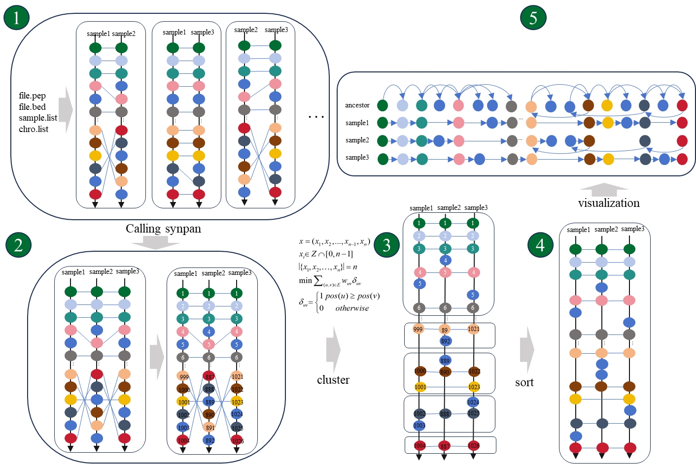

- 编译程序&安装依赖
```bash
# g++ 应当满足 C++ 17 标准，下载 compilers 以避免 服务器 gblic 版本过低问题
conda install -c conda-forge compilers

# 本流程依赖于 diamond 进行序列比对
conda install diamond -c bioconda

# python版本应当 > 3.8
pip install -r requirements.txt
make
```

- 手册和版本
```bash
# 主命令
python ordopan.py -h
python ordopan.py -v

# geneindex 排序子命令使用手册
python ordopan.py ordo -h

```

---

# 一.准备输入文件

- 输入数据： geneindex.txt，file.bed，sample.list，chro.list

- **geneindex.txt** 格式如下：
```tsv
spe1_gene1	spe2_gene1	spe3_gene1	-
spe1_gene2	spe2_gene2	spe3_gene2	-
spe1_gene3	spe2_gene3	spe3_gene3	spe4_gene1
spe1_gene4	-	spe3_gene4,spe3_gene5	spe4_gene2,spe4_gene3
spe1_gene5	spe2_gene4	spe3_gene6	spe4_gene4
spe1_gene6	spe2_gene5	spe3_gene7	spe4_gene5
```
>该文件是一个泛基因组文件。每一行表示一个同源基因簇，每一列表示同一个物种不用栽培系的基因组(使用 "\t" 间隔)。若是有重复基因，则使用 "," 隔开。

---

- **spe1.bed** 格式如下：
```tsv
A01     831     1437    spe1_gene1   .   +
A01     1487    2436    spe1_gene2   .   +
A01     2665    5455    spe1_gene3   .   +
A01     8421    9623    spe1_gene4   .   +
```
---

- **chro.list** 格式如下(标注染色体信息,那些 scaffold 或者 contig 则不需要填写)：
```tsv
A01
A02
A03
A04
A05
A06
```

- **sample.list** 格式如下：
```txt
spe1
spe2
spe3
spe4
```

---

# 二.无序泛基因组约束顺序

## 1.约束泛基因组顺序
```bash
# ordopan 的使用方法
python ordopan.py ordo -b bed_dir -s sample.list -c chro.list -g geneindex.final.txt -o output_dir -t thread_num
```

## 2.玉米泛基因组例子
```bash
# 测试玉米基因组排序
cd example
bash main.sh
```

# 三.子脚本工具
## 1.对单个染色体进行排序
> 若是某个染色体的排序不理想，可使用以下脚本重新对该染色体进行排序
```bash
# 0.获取 cluster 文件
# "python ordopan.py ordo" 会为每一条染色体生成对应的 num 文件
python ordopan.py cluster -i A01.num -o A01.cluster

# 1.基本运行
python ordopan.py sort -i A01.cluster -o outdir/A01

# 2.在排序后的基础上进一步迭代排序
python ordopan.py sort -i A01.cluster -s A01.sorted.num -o outdir/A01

# 3.迭代次数设置
python ordopan.py sort -i A01.cluster  --lns-n 30 -o outdir/A01
# --lns-n 单位为万次

# 4.对lns结果的边进行切割，指定阈值列表
python ordopan.py sort -i A01.cluster -r 0.95 0.98 1 -o outdir/A01
```

## 2.对指定染色体的 geneindex 以上述排序为参考重新调整顺序
```bash
# 对所有染色体都进行调整，根据已经排好序的num文件(file.sorted.num)
python ordopan.py ordo -b bed_dir -s sample.list -c chro.list -g geneindex.final.txt -o output_dir -t thread_num --resume-step sort
# --resume-step sort 表示从排序后的文件开始运行

# 对指定染色体进行调整
python ordopan.py resort -n A01.num -s A01.sorted.num -g A01.txt -o A01.sorted.txt

```

## 3.生成模拟数据
```bash
python ordopan.py imitate -gn 5000 -c 1 2 3 -gn 5000 -sn 50  -o imitate
# -gn 5000 : 每条染色体5000个基因左右
# -c : 染色体列表
# -sn : 基因组数量
# -o : 输出目录
```
